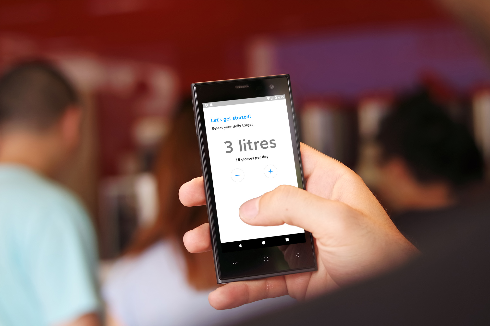
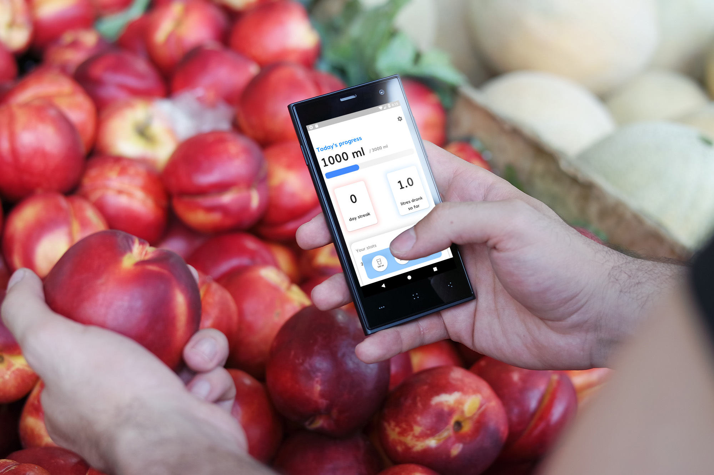
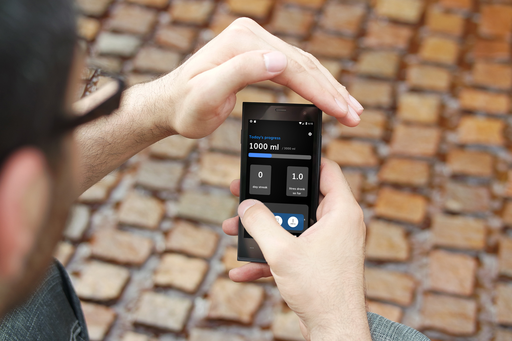
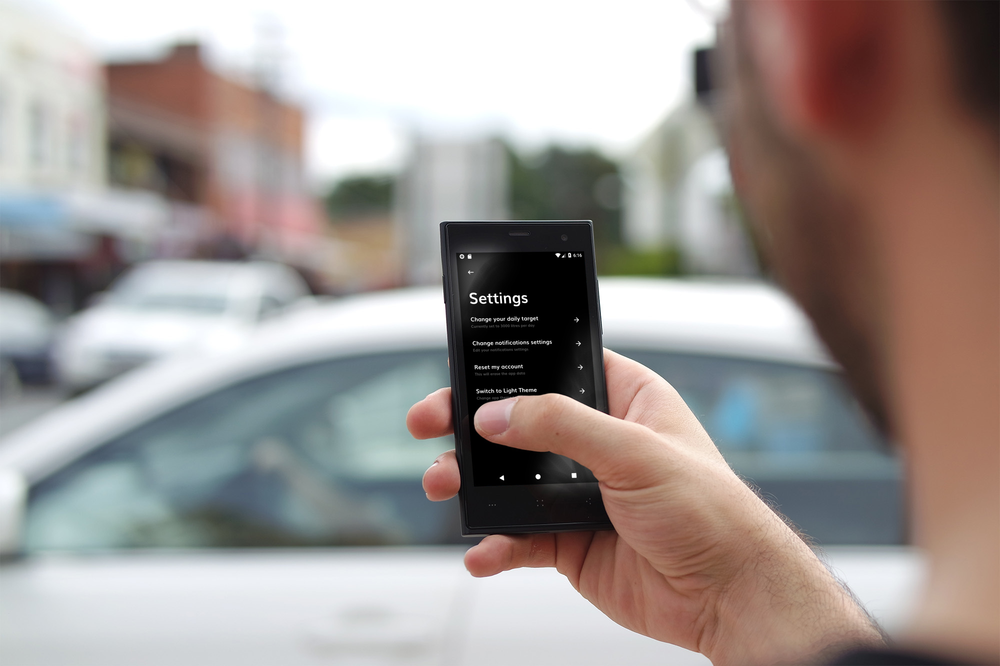

# Water Drink Reminder App

A cross platform mobile application to help you hydrate.

## Contributors

[Sivaram](https://github.com/ThalapathySiva) (me) - **Flutter Developer**

[Roshan G Rahman](http://github.com/roshanrahman) - **Designer**

## Release

> Download the [drink_remainder.apk](https://drive.google.com/open?id=1FDFxegr2W8v9EvL3-Jgso2JDfcwPddBU) for android

## Screenshots












## Features
- **Set intake goal**
- **Update your intake (100ml, 200ml, 1L) after you drink water.**
- **Notification to drink water (only on Android)**
- **Easy to use UI, with DARK mode.**
- **View your previous stats.**

## Tools used
- [Flutter & Dart](http://flutter.dev)
- [Local Schedule Notification](https://pub.dev/packages/local_notifications)
- [Provider](https://pub.dev/packages/provider)
- [Shared Preferences](https://pub.dev/packages/shared_preferences)

## How to run
```
flutter packages get
```

```
flutter run --release
```
